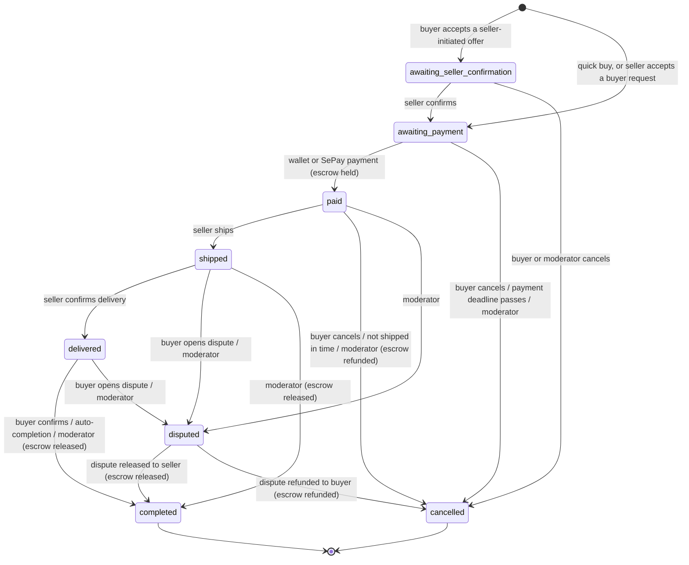

# Order lifecycle

Authoritative state machine for `Order.status` (INV-07) and the escrow effects tied to each transition (INV-01). Schema: `backend/src/modules/orders/order.model.js`.

## Transition table

| From | To | Actor | Escrow effect | Listing effect | Requirement |
|---|---|---|---|---|---|
| — | awaiting_seller_confirmation | Buyer accepts a seller-initiated offer | none | reserved (`pending`) | FR-ORD-03, FR-CHAT-05 |
| — | awaiting_payment | Quick buy; seller accepts a buyer-initiated request | payment deadline starts | reserved (`pending`) | FR-ORD-02, FR-ORD-03 |
| awaiting_seller_confirmation | awaiting_payment | Seller | payment deadline starts | — | FR-ORD-04 |
| awaiting_payment | paid | Buyer (wallet, SePay) | hold `totalToPay` | — | FR-ORD-05, FR-ORD-06 |
| awaiting_* | cancelled | Buyer, payment-timeout job, moderator | none | back to `active` | FR-ORD-10, FR-SYS-01, FR-MOD-04 |
| paid | shipped | Seller | none | — | FR-ORD-07 |
| paid | cancelled | Buyer, late-shipping job, moderator | refund full `totalToPay` | back to `active` | FR-ORD-10, FR-SYS-03 |
| shipped | delivered | Seller | none | — | FR-ORD-08 |
| delivered | completed | Buyer, auto-completion job, moderator | release payout (amount − fee), record fee | `sold` | FR-ORD-09, FR-SYS-02 |
| shipped, delivered | disputed | Buyer, moderator | stays held | — | FR-DSP-01 |
| disputed | completed | Moderator (release) | release payout | `sold` | FR-MOD-06 |
| disputed | cancelled | Moderator (refund) | refund full amount | back to `active` | FR-MOD-06 |
| disputed | completed + partial refund | Moderator (D-106) | split between buyer and seller | `sold` | FR-MOD-10 |

## Moderator transition matrix (baseline)

| Current | Allowed next |
|---|---|
| awaiting_seller_confirmation, awaiting_payment | cancelled |
| paid | shipped, disputed, cancelled |
| shipped, delivered | completed, disputed |
| disputed | completed, cancelled |
| completed, cancelled | — |

The baseline matrix also lists a `pending` order status that is not in the schema enum (DEF-17). The rebuild does not use it.

## Timers

The timers are configuration values (NFR-BIZ-02): payment window (D-104, default 3 minutes), shipping window 24 hours, auto-completion 5 days after delivery. The baseline `isEligibleForAutoRelease` virtual on the schema still encodes a 10-day shipped rule. It belongs to the retired FR-SYS-05 and must not be used by jobs.
